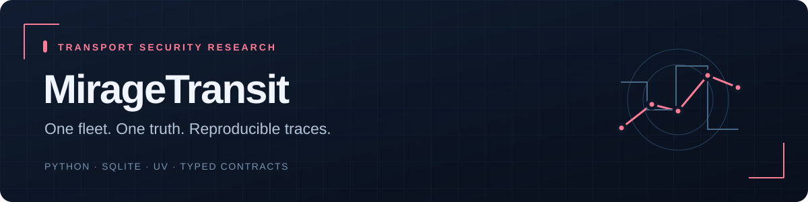

# MirageTransit

**0.1.0.dev2 · deterministic core and replay delivered**  
Python · SQLite · uv · Typed contracts

[Reviewer guide](docs/PORTFOLIO.md) · [Architecture](docs/ARCHITECTURE.md) · [Validation](docs/SPRINT_2.md) · [CI](https://github.com/zCooperHD/MirageTransit/actions)

**Cyber-Physical Deception Platform for Transportation Systems**

MirageTransit is a transport security research lab where a simulated fleet, decoy web portal, MQTT surface and virtual vehicle signals share one authoritative state. Suspicious interactions become observable simulation events and reproducible regression scenarios.

**Status:** Sprints 1–2 implemented: deterministic fleet core, local CLI, SQLite events and verified scenario replay. HTTP/MQTT decoys, analyst console, CAN adapters and deployment are planned in later sprints. See [Sprint 1](docs/SPRINT_1.md) and [Sprint 2 results and limitations](docs/SPRINT_2.md).

## Planned first release

A synthetic three-vehicle fleet; bounded vehicle dynamics; decoy HTTP and MQTT interfaces; correlated event timeline; canary breadcrumbs; deterministic scenario replay; private analyst console; local Docker deployment. Everything runs without purchasing hardware.

The engineering contribution is cross-protocol consistency and reproducible cyber-to-physical traces. Novelty or improved attacker engagement is a hypothesis to evaluate, not an established result.

## Read the plan

- [Product and scope](docs/PRODUCT.md)
- [Architecture and decisions](docs/ARCHITECTURE.md)
- [Data and protocol contracts](docs/CONTRACTS.md)
- [Implementation roadmap](docs/ROADMAP.md)
- [Containment and threat model](docs/THREAT_MODEL.md)
- [Evaluation and portfolio demonstration](docs/EVALUATION.md)

Documentation is in English so reviewers can inspect the project directly. All sample organizations, vehicles and credentials must be synthetic. No license has been selected; public visibility does not itself grant an open-source license.

## Quick start

Requires Python 3.12 (validated on 3.12.14) and uv 0.12.19. No hardware or GPU needed.

```bash
git clone https://github.com/zCooperHD/MirageTransit.git
cd MirageTransit
python -m pip install uv==0.12.19
uv sync --locked
uv run --locked miragetransit demo --seconds 60
```

The demo advances 60 seconds of simulation time without waiting a minute. It drives three
vehicles, applies braking, and returns the final state and normalized trace SHA-256.

```bash
uv run --locked miragetransit start --state runs/local.json --seed 42
uv run --locked miragetransit step --state runs/local.json --ticks 100 --vehicle MT-001 --ignition on --throttle 700
uv run --locked miragetransit inspect --state runs/local.json
uv run --locked miragetransit step --state runs/local.json --ticks 100 --vehicle MT-001 --throttle 0 --brake 1000
uv run --locked miragetransit stop --state runs/local.json
```

State files are explicit local checkpoints. Use one writer per file. Stop freezes the run;
it does not simulate braking. A stopped run rejects further commands. Choose a new file to start again.

Optional trace: `uv run --locked miragetransit demo --trace runs/demo.jsonl` (601 snapshots).
Existing state and trace files are never silently overwritten by start/demo.
Custom profiles: `start --profile path/to/profile.json --state runs/custom.json`.
Profile fields and synthetic dynamics are documented in [Sprint 1](docs/SPRINT_1.md).

## SQLite and replay — Sprint 2

Run the committed synthetic scenario directly:

```bash
uv run --locked miragetransit replay --input scenarios/normal-drive-v1.json
```

Or capture, export, replay and import your own deterministic demo:

```bash
uv run --locked miragetransit journal-demo --db runs/lab.sqlite --run demo
uv run --locked miragetransit run-events --db runs/lab.sqlite --run demo --limit 20
uv run --locked miragetransit run-export --db runs/lab.sqlite --run demo --output runs/scenario.json
uv run --locked miragetransit replay --input runs/scenario.json
uv run --locked miragetransit run-import --db runs/restored.sqlite --input runs/scenario.json
```

Replay verifies every tick and command result. Import is atomic and preserves the original run ID.
Use a new run ID/file if repeating setup; existing runs and bundles are never silently replaced.

Manual durable commands:

```bash
uv run --locked miragetransit run-start --db runs/manual.sqlite --run manual
uv run --locked miragetransit run-command --db runs/manual.sqlite --run manual --command-id ignition-1 --vehicle MT-001 --operation set_ignition --value true
uv run --locked miragetransit run-command --db runs/manual.sqlite --run manual --command-id throttle-1 --vehicle MT-001 --operation set_throttle --value 700
uv run --locked miragetransit run-step --db runs/manual.sqlite --run manual --ticks 100
uv run --locked miragetransit run-inspect --db runs/manual.sqlite --run manual
uv run --locked miragetransit run-stop --db runs/manual.sqlite --run manual
```

Retrying a command with the same ID/body returns its original receipt and does not apply it again.
Use a new command ID for a new intent. Commands can target a future `--at-tick`. A rejected command
is recorded and returns JSON with its reason and exit code 2. S1 checkpoint commands remain available.

## Development

```bash
uv run --locked ruff check .
uv run --locked ruff format --check .
uv run --locked mypy src
uv run --locked python scripts/check_lock.py
uv run --locked python -m unittest discover -s tests -v
uv build
uv run --locked python scripts/check_wheel.py
```

Runtime uses only the standard library. The lockfile fixes development dependencies;
the build backend and CI actions are pinned. Initial installation needs package access.
No public honeypot exposure or real vehicle connection is part of this sprint.

