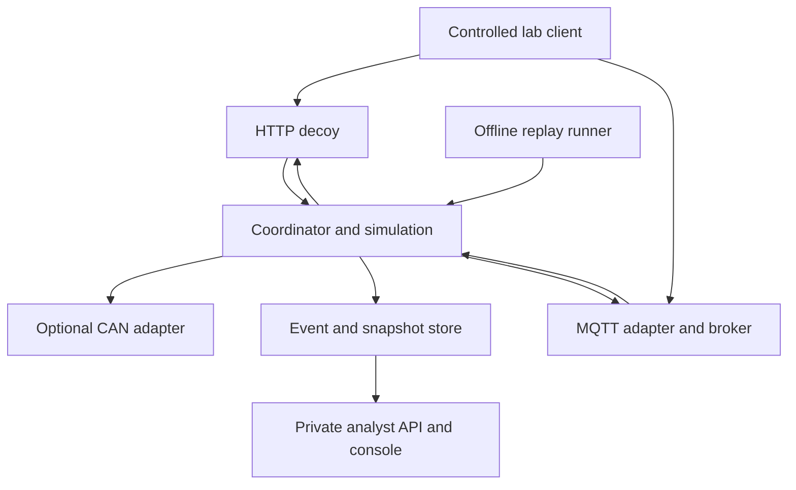

# Architecture and decisions

## Data flow

## Authoritative state
A single coordinator serializes accepted commands and advances a fixed 100 ms simulation tick. Adapters submit intents; they never write vehicle state directly. Each tick creates an immutable versioned snapshot, persisted together with resulting events in one transaction. Read adapters project snapshots; they report source version and age. A stale adapter must disclose staleness rather than invent data.

Transport acknowledgments are distinct from command acceptance and state application. MQTT QoS is not a substitute for application-level command deduplication.

Live command placement: validate, assign run sequence, schedule at the next tick, persist acceptance and scheduled tick, then apply. Replay supplies recorded tick and sequence directly, bypassing live arrival times.

## Implemented core and proposed adapter stack
| Area | Choice | Reason |
| --- | --- | --- |
| Simulation/contracts | Python 3.12, typed models, integer/fixed-point state | Fast iteration and deterministic core |
| API | FastAPI with schema validation | HTTP contracts and analyst API |
| Persistence | SQLite WAL, one coordinator writer | Low operational burden |
| Messaging | Mosquitto plus Python MQTT adapter | Real MQTT protocol surface |
| CAN | Optional python-can SocketCAN/vCAN | Linux transport integration |
| Console | React, TypeScript, Vite | Interactive inspection and timeline |
| Core tests | unittest, Ruff and strict mypy | Implemented domain, CLI, storage and replay checks |
| Future adapter/UI tests | Browser and protocol fixtures | Planned analyst/decoy integration evidence |
| Packaging | Docker Compose | Reproducible homelab topology |

The Python simulation, SQLite persistence and replay are implemented in Sprints 1–2 with no third-party runtime dependencies. Development/build tooling is pinned in `uv.lock`; CI verifies its fingerprint. FastAPI, MQTT, CAN, React and Docker in this table remain proposed later-sprint dependencies and are not installed by the current core. No C++ until profiling justifies it; no Kubernetes, Redis or external database for this scale.

## Logical boundaries and process split
Core: simulation, command policy, event writer, profile loader, replay engine.
Decoy adapter process: HTTP portal with no analyst routes or direct database access.
MQTT process: broker with per-run synthetic accounts and restricted topic ACLs; adapter translates messages.
Analyst process: authenticated read/control API, serves frontend and uses narrow internal core API.
SQLite: core-owned volume; analyst queries through core, not a second uncontrolled writer.
S1 may keep modules in one process to prove logic. S3 must enforce the process/network split before decoy services are made reachable.

## Planned repository layout
`src/miragetransit/{core,profiles,adapters,storage,analyst,replay}`
`web/analyst`, `web/decoy`, `schemas`, `profiles`, `scenarios`, `tests/{unit,integration,e2e}`, `deploy`, `benchmarks`, `docs/adr`.

## Reliability
Bound payloads, subscriptions, queues and per-session event counts. Reject commands if the coordinator is unavailable; do not buffer indefinitely. Use an idempotency key scoped to run and vehicle. On persistence failure, pause the run and surface an error rather than silently losing evidence. Broker restart triggers adapter resubscription and fresh versioned telemetry; old retained commands must never execute.
Recovery restores the latest committed snapshot and event sequence. Explicit schema migration and export versions precede persistence changes.

## Replay
Manifest includes seed, fixed timestep, profile hash, runtime/lock hash, initial snapshot, accepted and rejected intents, assigned tick/sequence, model version and state hashes. Normalize away wall-clock timestamps and generated network session IDs. Sort all iteration and use fixed-point arithmetic. Pin runtime as a seed alone does not ensure cross-version reproducibility.

Two modes: domain replay re-executes intents and checks state; protocol replay uses controlled local fixtures and checks adapter behavior. Never replay arbitrary captured requests against external hosts.

## Sources and limitations
- Linux SocketCAN/vCAN: https://docs.kernel.org/networking/can.html — virtual interfaces do not model physical bus arbitration, wiring or electrical faults.
- Docker network specification: https://docs.docker.com/reference/compose-file/networks/ — internal networks support segmentation; host firewall and reachability tests are still required.
- Python reproducibility notes: https://docs.python.org/3/library/random.html#notes-on-reproducibility — lock runtime and record more than a seed.

All design choices above are proposals, not claims made by these sources.
